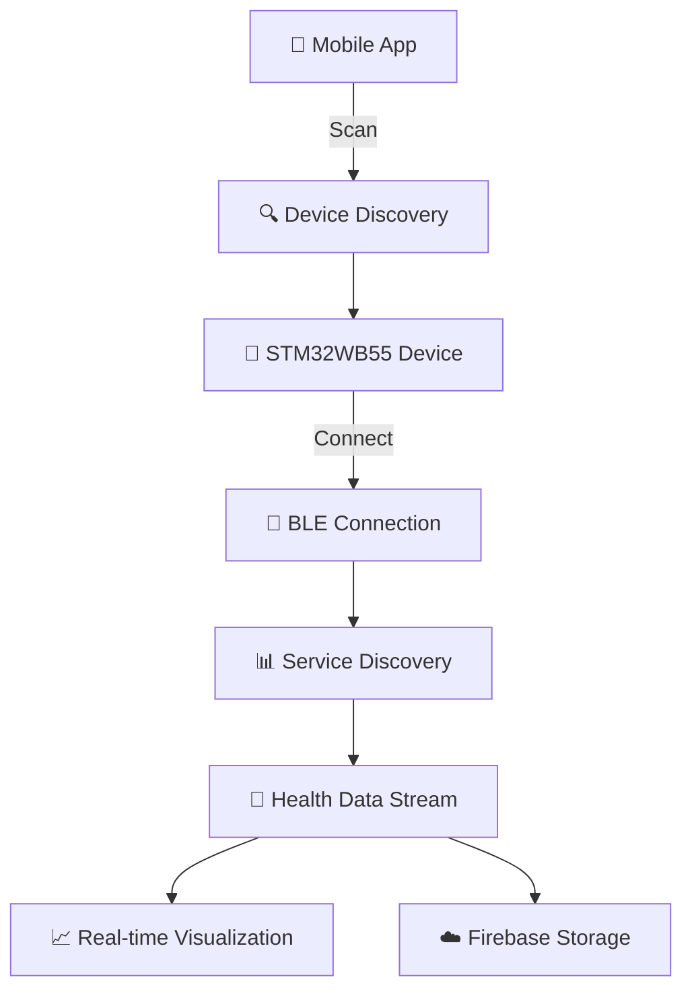

<div align="center">

# 🩺 Vital Monitor

### Real-Time Health Monitoring with Bluetooth Low Energy

*A cross-platform Flutter application for monitoring vital signs using STM32WB55 and other BLE devices*

[](https://flutter.dev)
[](https://firebase.google.com)
[](https://dart.dev)

</div>

---

## 🌟 Features

<table>
<tr>
<td width="50%">

### 🔐 **Security & Authentication**
- 🔒 Secure Firebase authentication
- 👤 User profile management
- 🛡️ Data privacy protection

### 📱 **Real-Time Monitoring**
- 💓 Live pulse waveform visualization
- 🌡️ Skin temperature tracking
- 👣 Step counter integration
- ⚠️ Fall detection alerts

</td>
<td width="50%">

### 📊 **Data Visualization**
- 📈 Interactive health charts
- 📉 Historical data analysis
- 🎨 Beautiful UI with dark mode
- 📋 Comprehensive health reports

### 🔗 **Bluetooth Integration**
- 🔍 Smart device discovery
- 📡 STM32WB55 compatibility
- 🔄 Auto-reconnection
- ⚡ Low energy consumption

</td>
</tr>
</table>

---

## 🚀 Quick Start

### 📋 Prerequisites

| Requirement | Version | Link |
|-------------|---------|------|
| Flutter SDK | ≥ 3.0.0 | [Install Flutter](https://flutter.dev/docs/get-started/install) |
| Dart SDK | ≥ 2.17.0 | [Get Dart](https://dart.dev/get-dart) |
| Firebase Project | Latest | [Firebase Console](https://console.firebase.google.com/) |
| BLE Device | STM32WB55+ | [STM Documentation](https://www.st.com/en/microcontrollers-microprocessors/stm32wb55.html) |

### 🛠️ Installation

```bash
# 1️⃣ Clone the repository
git clone https://github.com/yourusername/vital_monitor.git
cd vital_monitor

# 2️⃣ Install dependencies
flutter pub get

# 3️⃣ Configure Firebase (see setup guide below)

# 4️⃣ Run the application
flutter run
```

### 🔥 Firebase Setup

<details>
<summary><b>📱 Android Configuration</b></summary>

1. Add your `google-services.json` to `android/app/`
2. Ensure your package name matches Firebase config
3. Enable Authentication and Firestore in Firebase Console

</details>

<details>
<summary><b>🍎 iOS Configuration</b></summary>

1. Add your `GoogleService-Info.plist` to `ios/Runner/`
2. Configure your bundle identifier
3. Enable required capabilities in Xcode

</details>

---

## 🏗️ Architecture

```
📁 lib/
├── 🎮 controllers/         # State management (GetX)
│   ├── bluetooth_controller.dart
│   └── user_controller.dart
├── 📱 views/               # UI screens
│   ├── home_page.dart
│   ├── device_details_page.dart
│   ├── health_monitor_page.dart
│   └── health_history_page.dart
├── 🧩 widgets/             # Reusable components
│   └── pulse_waveform_chart.dart
├── 🔧 utils/               # Helper functions
├── 🌐 services/            # External integrations
└── 🚀 main.dart            # Entry point
```

---

## 📡 BLE Protocol & Data Flow

<div align="center">



</div>

### 📊 Supported Health Metrics

| Metric | Unit | Frequency | Accuracy |
|--------|------|-----------|----------|
| 💓 Pulse Waveform | Raw Values | 4Hz | ±2% |
| 👣 Step Count | Steps | Real-time | ±5% |
| 🌡️ Skin Temperature | °C | 1Hz | ±0.1°C |
| ⚠️ Fall Detection | Boolean | Event-based | 98%+ |

---

## 🎨 Screenshots

<div align="center">
<table>
<tr>
<td align="center">

<br><b>🏠 Home Screen</b>
</td>
<td align="center">

<br><b>📊 Health Monitor</b>
</td>
<td align="center">

<br><b>🔧 Device Details</b>
</td>
</tr>
</table>
</div>

---

## 🔧 Customization Guide

### 🎯 Adding New Health Metrics

```dart
// In bluetooth_controller.dart
final _newMetric = 0.obs;
int get newMetric => _newMetric.value;

// Add processing in updatePulseWaveform()
void updatePulseWaveform(List<int> rawBytes) {
  // ...existing code...
  _newMetric.value = processedValue;
}
```

### 🎨 Custom UI Themes

```dart
// Modify theme in main.dart
ThemeData.dark().copyWith(
  primaryColor: Colors.yourColor,
  accentColor: Colors.yourAccent,
  // ...additional customizations
);
```

---

## 🤝 Contributing

We welcome contributions! Here's how you can help:

<div align="center">

| Type | How to Contribute |
|------|-------------------|
| 🐛 **Bug Reports** | [Open an Issue](https://github.com/yourusername/vital_monitor/issues) |
| 💡 **Feature Requests** | [Start a Discussion](https://github.com/yourusername/vital_monitor/discussions) |
| 🔧 **Code Contributions** | [Submit a Pull Request](https://github.com/yourusername/vital_monitor/pulls) |
| 📚 **Documentation** | Edit README or add docs |

</div>

### 🌟 Contributors

<div align="center">

[](https://github.com/yourusername/vital_monitor/graphs/contributors)

</div>

---

## 📄 License

<div align="center">

This project is licensed under the **MIT License** - see the [LICENSE](LICENSE) file for details.

[](https://opensource.org/licenses/MIT)

</div>

---

## 🙏 Acknowledgements

<div align="center">

### 🛠️ **Built With**

[](https://flutter.dev/)
[](https://firebase.google.com/)
[](https://pub.dev/packages/get)
[](https://pub.dev/packages/fl_chart)

### 🏢 **Powered By**

- [STMicroelectronics](https://www.st.com/) for BLE hardware reference
- [Flutter Community](https://flutter.dev/community) for amazing packages
- [Firebase](https://firebase.google.com/) for backend infrastructure

</div>

---

<div align="center">

### 📧 **Contact & Support**

**Developer:** Siddhanth P Vashist  
**Email:** [siddhanthpvashist@gmail.com](mailto:siddhanthpvashist@gmail.com)  
**GitHub:** [@A-X-Z-Y-T-E](https://github.com/A-X-Z-Y-T-E)

---

<sub>Made with ❤️ using Flutter | © 2024 Vital Monitor</sub>

</div>
